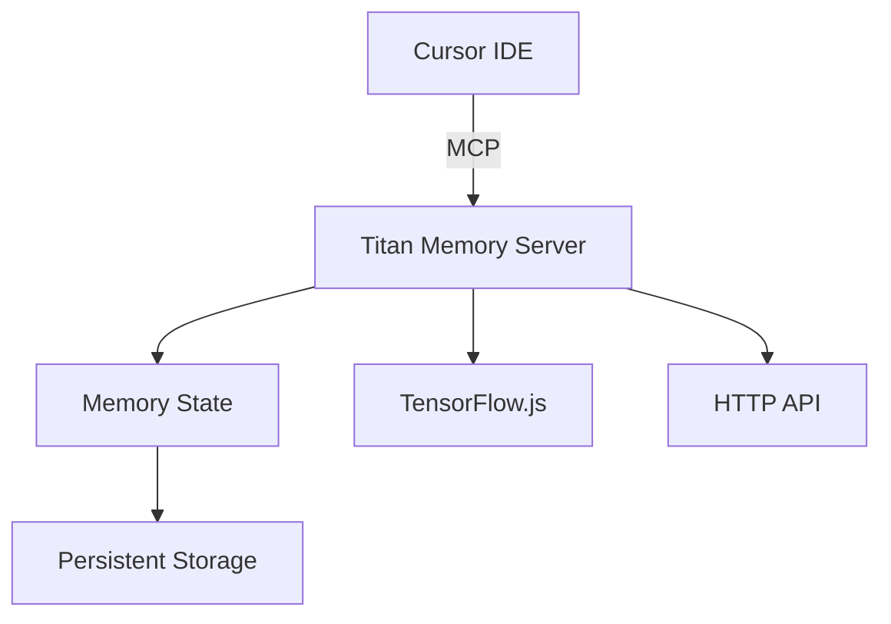

# Titan Memory MCP Server Documentation

Welcome to the Titan Memory MCP Server documentation! This documentation will help you understand, install, and use the server effectively.

## Table of Contents

### Getting Started
- [Installation](../README.md#installation)
- [Quick Start](../README.md#usage)
- [Features](../README.md#features)

### Guides
- [Cursor IDE Integration](guides/cursor.md)
- [Basic Usage Examples](examples/basic-usage.md)

### API Reference
- [Server API](api/README.md)
- [HTTP Endpoints](api/README.md#http-api)
- [Tool Reference](api/README.md#available-tools)

### Development
- [Contributing Guidelines](../CONTRIBUTING.md)
- [Development Setup](../CONTRIBUTING.md#development-setup)
- [Testing](../CONTRIBUTING.md#testing)

### Additional Resources
- [GitHub Repository](https://github.com/henryhawke/mcp-titan)
- [Issue Tracker](https://github.com/henryhawke/mcp-titan/issues)
- [Model Context Protocol](https://modelcontextprotocol.io)

## Overview

The Titan Memory MCP Server is a Model Context Protocol implementation that provides memory-augmented learning capabilities for Cursor IDE. It maintains a persistent memory state that evolves based on interactions, enabling contextual awareness and learning over time.

### Key Features

- 🧠 Automatic memory management
- 🔄 Real-time updates
- 📊 Memory state analysis
- 🔌 Cursor IDE integration
- 🚀 HTTP API support
- 💾 Persistent storage

### Architecture

The server automatically saves the memory state every 5 minutes, and it's initialized with zeros when first created. The memory vectors are 768-dimensional by default, which is a common size for language model embeddings.

### Getting Help

1. Check the [documentation](api/README.md)
2. Look through [examples](examples/basic-usage.md)
3. Search [existing issues](https://github.com/henryhawke/mcp-titan/issues)
4. Create a new issue if needed

### Contributing

We welcome contributions! Please see our [Contributing Guidelines](../CONTRIBUTING.md) for details on:

- Code style
- Pull request process
- Development setup
- Testing requirements

### License

This project is licensed under the MIT License - see the [LICENSE](../LICENSE) file for details. 